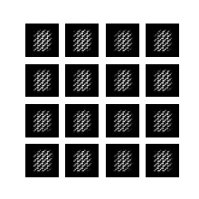

# keras-only-GAN
Implementing GANs using keras only.

# DCGAN_MNIST
Generating MNIST images based on DCGAN.



```bash
...
10000: [discriminator loss: 0.577775, acc: 0.648438] [adversarial loss: 1.216242, acc: 0.234375]
```
